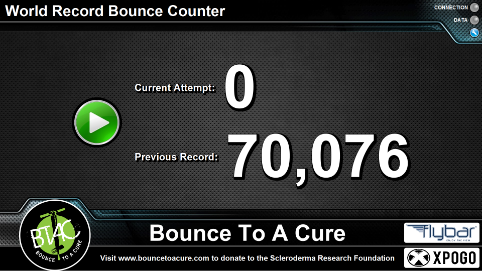

# Bounce Counter 
Created June 2013

## Description

This program was created to count the number of bounces performed on a pogo stick over time.

The interface was created with JavaFX and stylized using CSS.
Java was used for the serial communication layer which interacts with the Arduino Uno board.

The Arduino Uno board is connected to a safety mat which is used as a simple switch when >15 lbs of force is applied.

## TO:DO

While the program works in its current state, I still want to add a few more features:

1. pop-up yes/no dialog messages when Start/Stop is pressed
	- this will help ensure that the user truly wanted to press the button
2. a log file which records the time and bounce count whenever a bounce is detected
	- this can be used to show the rate of bouncing over time and potentially draw some analytics from
3. stylize the settings window
4. stylize the numbers (make numbers bigger, perhaps color coded as current attempt gets higher)
5. modify the program to also count for most bounces in one minute
6. have an internal timer which starts counting once the first bounce is detected
7. real-time visual heartrate for bounces
	- more practical for most bounces in a minute to see where the pogoer slows down